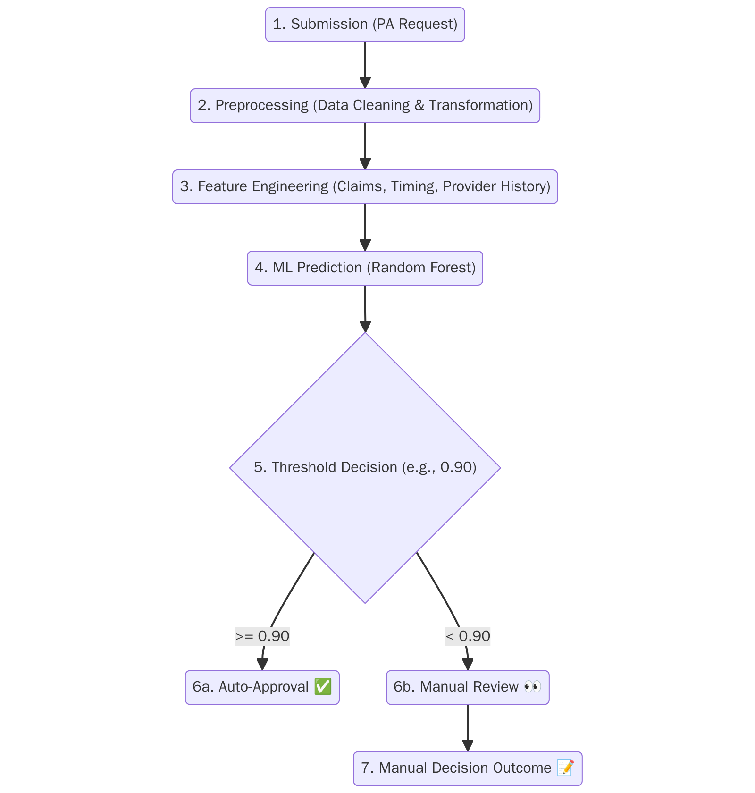

# 🐾 Healthy Pets Auto-Approval Machine Learning Model

## Overview

This project addresses inefficiencies in the prior authorization (PA) process for veterinary procedures. Healthy Pets receives requests that must be evaluated for coverage and clinical appropriateness. Some are handled by rule-based systems, but many require manual review—creating delays, operational burden, and inconsistency. This repository presents a machine learning model to predict which PA requests can be safely auto-approved.

## 📌 Objective

- Predict whether a PA request should be auto-approved using machine learning.
- Reduce manual reviews while maintaining clinical appropriateness.
- Seamlessly integrate with existing rule-based systems.

## 📊 Data Exploration & Insights

Key findings from a dataset of ~1,900 prior authorization requests:
- **72.5%** were approved.
- Approval likelihood increases for routine procedures (e.g., check-ups).
- Providers and prior history (claims, approvals) influence decision outcomes.
- Time since last request or claim is a strong predictor: “cold cases” tend to be denied.

## 🧠 Modeling Approach

Three models were evaluated:
- Logistic Regression  
- Random Forest  
- XGBoost  

The **Random Forest** model was selected for its high F1 score and interpretability.

### Feature Engineering Highlights:
- Prior approvals and claims history
- Provider/service-level patterns
- Time-based features

## 🔄 ML Auto-Approval Flow

This flow represents how PA requests move through the ML pipeline:
1. Submission (PA Request)
2. Preprocessing (Data Cleaning & Transformation)
3. Feature Engineering (Claims, Timing, Provider History)
4. ML Prediction (Random Forest)
5. Threshold Decision (e.g., 0.90)
6a. Auto-Approval ✅
6b. Manual Review 👀
7. Manual Decision Outcome 📝

## 📈 Evaluation

Model outputs were evaluated at various decision thresholds:

| Threshold | Precision | Recall | F1 Score | Auto-Approval Rate |
|-----------|-----------|--------|----------|--------------------|
| **0.47** (Balanced) | 88% | 86% | 0.87 | ~74% |
| **0.90** (Conservative) | 98% | 42% | 0.58 | ~29% |

## ✅ Recommendations

- **Start with threshold = 0.90** to prioritize safety.
- Monitor precision, recall, and auto-approval rates in production.
- Use manual review for all low-confidence cases.
- Gradually lower the threshold after validation to expand automation coverage.

## 🚀 Next Steps

- Deploy the model in a pilot phase with selected providers or services.
- Continuously monitor model performance and manual review alignment.
- Retrain periodically with new data and feedback.
- Expand automation scope once real-world performance is validated.

## 📁 Repository Structure
healthy-pets-auto-approval-ml/
├── healthy_pets_prior_auth_model.ipynb # ML model notebook
├── Presentation_Healthy_Pets_AutoApproval_Model_Presentation.pptx # Summary deck
├── diagram.png # Auto-Approval Flowchart
└── README.md # Project documentation

